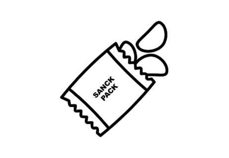

# Snack Pack


Boiler plate collection of applications needed for a full stack web site.
 - Typescript
 - Sequilize
 - Tailwind
 - Express
 - Nextjs
 - Postgres
 - GCP configs (TBD)

## Setup and Development

Prerequisites to run this project
 - `nvm` 
 - `yarn`
 - `docker`

1. Clone repo locally. See [Duplicating a repository](https://docs.github.com/en/github/creating-cloning-and-archiving-repositories/duplicating-a-repository) to start a new project without forking.
```
git clone git@github.com:ybbobdev/snack-pack.git
cd snack-pack
```

2. Copy this command and run it in the root of the project. This creates `secrets` with environment variables used for PostgresSQL and PGAdmin.
```bash
[ -f "secrets" ] && echo "secrets exists" || echo -e "export POSTGRES_USERNAME=snack\nexport POSTGRES_PASSWORD=pack\nexport PGADMIN_USERNAME=snack@pack.com\nexport PGADMIN_PASSWORD=pack" > secrets
```

3. Run commands for local development
```
# start postgres and pgadmin
docker-compose up

# start site and api
nvm install $(cat .nvmrc) && nvm use
yarn install
yarn dev
```

4. Preview site
 - SITE: [http://localhost:3030/](http://localhost:3030/)
 - API: [http://localhost:3031/](http://localhost:3031/__health)

5. Update [`appConfig.json`](./appConfig.json) and `secrets` as needed.

## Reference
 - See [`docs/docker-postgres-setup.md`](docs/docker-postgres-setup.md) for handy docker commands for viewing the `postgres` db and `pgadmin`.
 - [Sequilize](https://sequelize.org/master/)
 - [NVM](https://github.com/nvm-sh/nvm)
 - [Yarn](https://yarnpkg.com/)
 - [Docker](https://www.docker.com/)
 - [Next js](https://nextjs.org/docs/getting-started)
 - [Tailwind](https://tailwindcss.com/docs)
 - [Tailwind color theme generator](https://tailwind.ink/)

